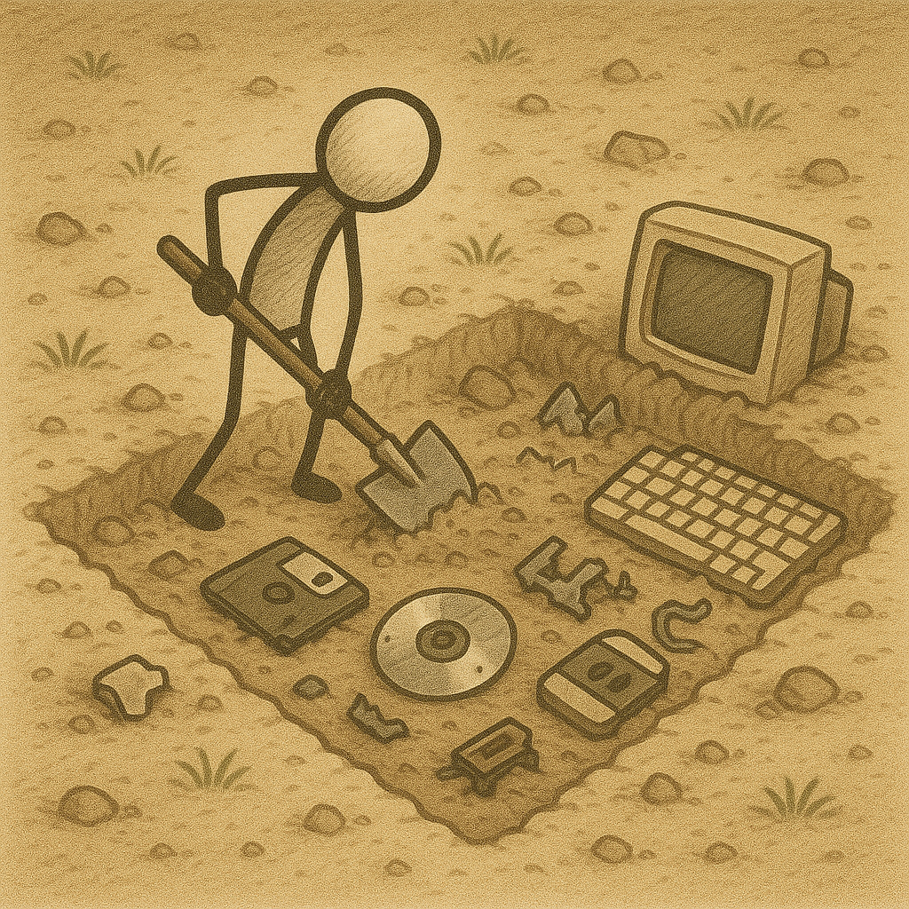

<link rel="stylesheet" href="/UNIX-beginner-course/assets/css/custom.css">

# Uvod

## Šta je UNIX i gde je tu Linuks?

Unix je operativni sistem nastao 1960-ih godina. Bio je prvi portabilan operativni sistem pisan u programskom jeziku C, što je omogućavalo da se isti kod izvršava na više različitih računara. Pre njega, programi su se pisali specijalizovani za arhitekturu računara na kom su se i izvršavali, odnosno nisu bili portabilni. Kako je predstavljalo problem da se stalno prepravlja kod, uvođenje standarda je bilo neophodno. OS/360 je bio IBM-ov operativni sistem koji je krenuo sa sličnom idejom, ali je bio samo za određene njihove procesore.

Sam UNIX sistem je zapravo predstavljao više manjih specijalizovanih programa koji rešavaju jedan problem. Ovaj princip poznat kao UNIX filozofija i koristi se i danas u razvoju softvera. UNIX filozofija iz Bell System Tehnical Journal (Doug MCIlroy 1978):
  * Make each program do one thing well. To do a new job, build afresh rather than complicate old programs by adding new "features".
  * Expect the output of every program to become the input to another, as yet unknown, program. Don't clutter output with extraneous information. Avoid stringently columnar or binary input formats. Don't insist on interactive input.
  * Design and build software, even operating systems, to be tried early, ideally within weeks. Don't hesitate to throw away the clumsy parts and rebuild them.
  * Use tools in preference to unskilled help to lighten a programming task, even if you have to detour to build the tools and expect to throw some of them out after you've finished using them.

Razvoj UNIXa je podstakao je razvoj sličnih sistema, međutim postojalo je par različitih verzija. Kako je bio potreban zajednički sistem, nastao je POSIX strandard (Portable Operating System Interface) koji je u početku specifikovao samo interfejs. Njega definiše IEEE i služi da održi kompatibilnost između operativnih sistema koji ga implementiraju. 

Prirodno se postavlja pitanje, gde je tu onda Linuks? Linuks je zapravo GNU softver (GNU's not Unix) sa Linuks kernelom (kernel je program koji služi za komunikaciju nikog nivoa sa računarom). Linuks je POSIX-compliant te omogućava da se programi mogu pokretati i na drugim UNIX sistemima. Ponekad se pogrešno tumači kada se priča o Linuksu, gde se zapravo misli na pojedinačne distribucije (Ubuntu, Debian, Arch, Mint, itd.), te treba primetiti razliku.

Sada ćemo preći na to šta ćemo raditi ostatak ovog kursa.

# Pitanja za razmišljanje
* Kako bi se mogla primeniti UNIX filozofija na implementaciju kalkulatora? Šta bi svaki princip predstavljao u takvoj aplikaciji? Koje bi mogućnosti sve imala takva aplikacija i kako bi bila podeljena?

  

    <a href="../index.html" class="button-nav">← Prethodna</a>
  

  

    <a href="1_2-bash.html" class="button-nav">Sledeća →</a>
  

