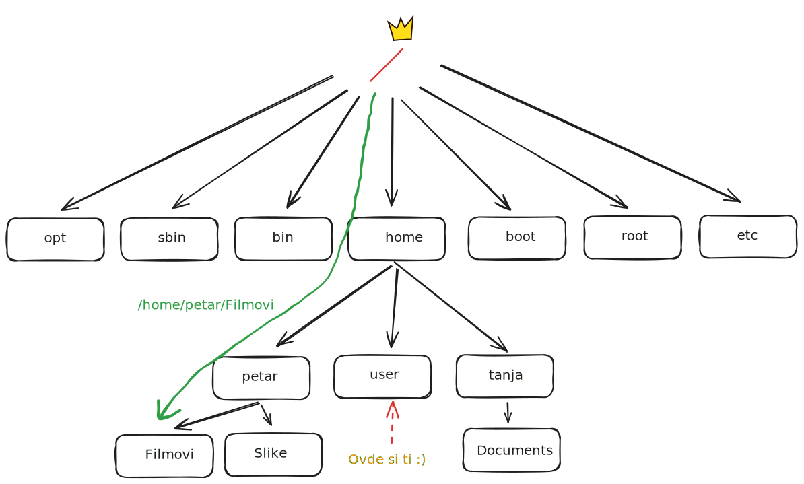
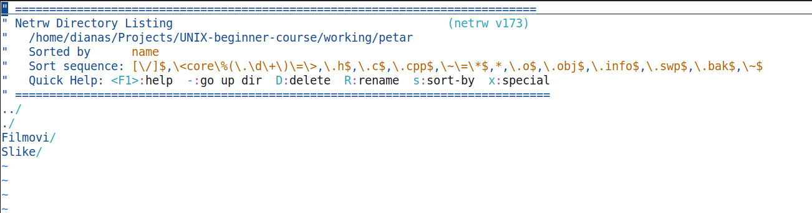
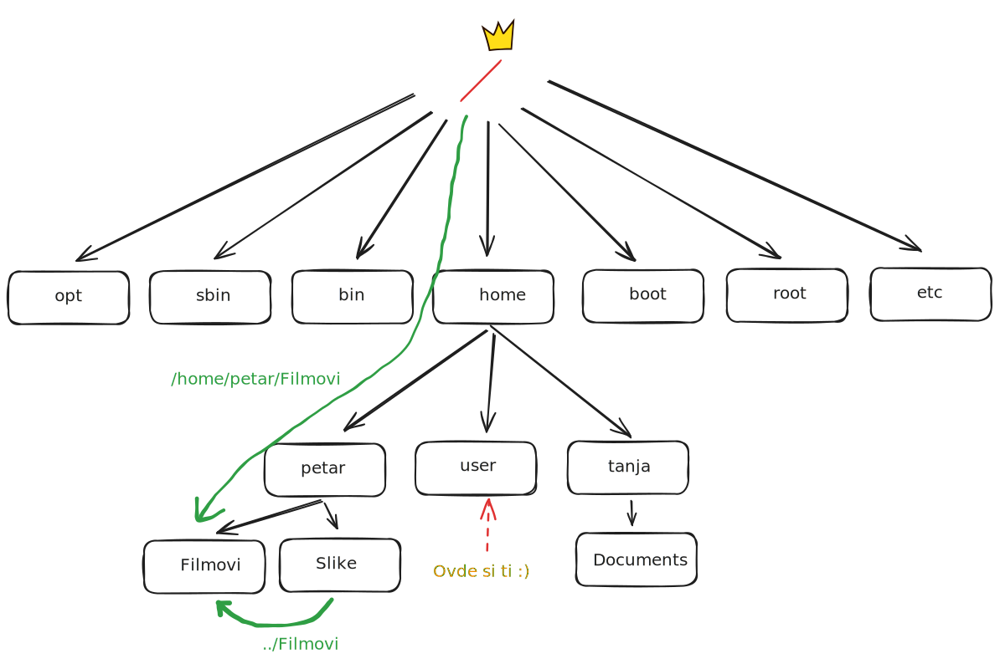

<link rel="stylesheet" href="/UNIX-beginner-course/assets/css/custom.css">


<div style="margin-bottom: 1em;">
  <a href="/UNIX-beginner-course/" class="button-nav">⟵ Nazad na početak</a>
</div>

# Sistem datoteka u Linuksu i rad sa njim

Da bi mogli da radimo sa datotekama, potrebno je da razumemo strukturu sistema datoteka. Linuks sistemi koriste EXT4 sistem datoteka i on je stablaste strukture. U korenu je takozvani ```root``` direktorijum u oznaci ```/```. On sadrži ostale direktorijume od kojih ćemo istaći:
  * direktorijum sa izvršnim fajlovima programa ```bin``` i `sbin`
  * root korisnika (administrator sistema sa svim pravima) `root`
  * direktorijum sa drugim korisnicima `home`

Dalje svaki od ovih direktorijuma ima svoje podirektorijume i fajlove. Mi ćemo se fokusirati na `home` direktorijum. `home` direktorijum sadrži po direktorijum za svakog korisnika na sistemu. Svi vaši podaci će se nalaziti u `username` podirektorijumu smeštenom u `home`.

Potrebno je da razumemo zapis putanje ovakvog sistema fajlova. Postoje dva tipa putanja: apsolutna i relativna.

**apsolutna** putanja sadrži celu putanju od korenog (`/`) direktorijuma do željenog. Na primer, ukoliko želimo da pristupimo `Filmovi` direktorijumu korisnika `petar`, putanja bi izgledala ovako: `/home/petar/Filmovi`. Bitno je obratiti pažnju na dve stvari u ovom primeru:
  1. Razdvajanje naziva direktorijuma ima istu oznaku kao i koreni direktorijum `/`, a ne whitespace
  2. Kako je **bash** case-sensitive, `Filmovi` i u putanji mora da sadrži veliko slovo `F`. Da je zapisano malim slovom, to bi predstavljalo drugi direktorijum, ukoliko takav postoji.

Na slici se može videti gde se direktorijum `Filmovi` nalazi u sistemu datoteka.



Unix sistemi prate filozofiju "sve je fajl". Tako da se komunikacija sa konektovanim uređajima vrši preko fajlova, razni podaci o procesima su fajlovi, ali i **sami direktorijumi**. Na slici ispod se nalazi primer gde je direktorijum `petar` otvoren u tekstualnom editoru `vim` (kasnije ćemo naučiti kako se koristi). Kao što možemo da vidimo iz strukture sistema datoteka pored, njegov sadržaj se nalazi u editoru. Jedina razlika koja postoji su dve linije `.` i `..`. Ovo su dva specijalna fajla koji su linkovi, `..` pokazuje na roditeljski direktorijum (osim za root `/` koji nema roditelja) i `.` je pokazivač na samog sebe. 



Sada da ne bi kucali beskonačne redove iznova i iznova, možemo da skratimo naše putanje tako što ćemo koristiti `.` i `..`. Putanju do nekog direktorijuma možemo pisati u odnosu na lokaciju na kojoj se trenutno nalazimo. Na primer, ukoliko se nalazimo u direktorijumu `/home/petar/Slike` i želimo da pristupimo direktorijumu `/home/petar/Filmovi`, u skraćenom zapisu možemo reći samo `../Filmovi`. Jedino je bitno da vodimo računa da ukoliko promenimo direktorijum u kom se nalazimo, moramo da ažuriramo i putanju. Ilustracija se nalazi na slici ispod. Ovakav tip zapisa se naziva **relativna** putanja.




Da bi mogli da uradimo nešto sa ovim sistemom datoteka, potrebno je da objasnimo osnovne komande za rad sa njim. **Komanda** se sastoji iz imena, opcija i parametara, kao što je prikazano na slici (komanda postoji, probaj da instaliraš i pokreneš :wink: ). Uvek je prva reč koja se napiše naziv komande, potom se razmakom odvajaju opcije (ako se prosleđuju) i parametri. Bitno je napomenuti da ukoliko naziv fajla ili direktorijuma ima razmak u sebi, mora da se drugačije tretirata i to će biti objašnjeno kasnije. U suprotnom, shell će razmak tumačiti kao razmak između više parametara. Kraj komande, odnosno pokretanje iste se izvršava pritiskanjem tastera `enter`, odnosno unosom nove linije u terminal.


Bitne komande za rad sa direktorijumima su:

  * `cd` - promena trenutnog direktorijuma
  * `ls` - izlistavanje sadržaj direktorijuma
      * `tree` - lepši prikaz, ali se mora dodatno instalirati 
  * `pwd` - ispis putanje do trenutnog direktorijuma
  * `mv` - premeštanje
  * `cp` - kopiranje
  * `mkdir` - pravljenje direktorijuma
  * `rm` - brisanje

U nastavku ćemo preći jednu po jednu komandu sa objašnjenjima i primerima.

<div class="nav-buttons-wrapper">
  <div class="nav-left">
    <a href="1-unix.html" class="button-nav">← Prethodna</a>
  </div>
  <div class="nav-right">
    <a href="2_1-pwd.html" class="button-nav">Sledeća →</a>
  </div>
</div>