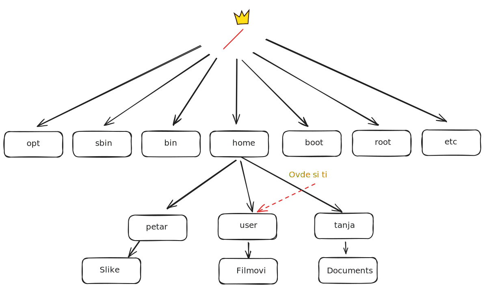

<link rel="stylesheet" href="/UNIX-beginner-course/assets/css/custom.css">

  <a href="/UNIX-beginner-course/" class="button-nav">⟵ Nazad na početak</a>

 

# Ispis trenutne putanje - pwd

Ovo je jednostavna, ali dosta korisna komanda. U promptu se ne vidi ceo naziv putanje na kojoj se nalazimo. U zavisnosti od konfiguracije, može se menjati, ali nije praktično da stalno stoji cela putanja ispisana, te se često skraćuje da se vide samo prva slova svakog direktorijuma, ili čak da se vidi samo naziv trenutnog. U toku rada, može se desiti da se "izgubimo" i da nam treba apsolutna putanja do mesta na kom se nalazimo. Za ovo potrebe koristimo komandu `pwd`. Nije potrebno prosleđivati nikakve opcije za ovu potrebu, iako one postoje, neće biti pokrivene ovim kratkim tutorijalom.

Primer ispisa se nalazi u prikazu terminala, a struktura sistema direktorijuma na slici. 

  

    <a href="2-filesystem_functions.html" class="button-nav">← Prethodna</a>
  

  

    <a href="2_2-cd.html" class="button-nav">Sledeća →</a>
  

