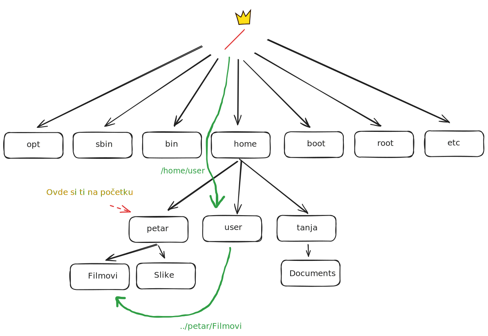

<link rel="stylesheet" href="/UNIX-beginner-course/assets/css/custom.css">

  <a href="/UNIX-beginner-course/" class="button-nav">⟵ Nazad na početak</a>

# Kretanje kroz direktorijume - cd

Sledeća bitna komanda je `cd` (Change the working Direcotry). Ona nam omogućava da se krećemo po sistemu datoteka, odnosno da promenimo trenutni direktorijum u kom se nalazimo. Od parametara, neophodno je proslediti putanju na koju želimo da odemo. Zapis putanje može biti i apsolutni i relativni, samo je bitno da je zapis **case-sensitive**. Primer nam pokazuje sa komandom `pwd` gde se nalazimo, potom prelazi u direktorijum `/home/user`, sa komandom `pwd` ponovo potvrđujemo da se zaista promenio direktorijum u kom se nalazimo.

Ovo možete i vi isprobati u .

  

    <a href="2_1-pwd.html" class="button-nav">← Prethodna</a>
  

  

    <a href="2_3-ls.html" class="button-nav">Sledeća →</a>
  

