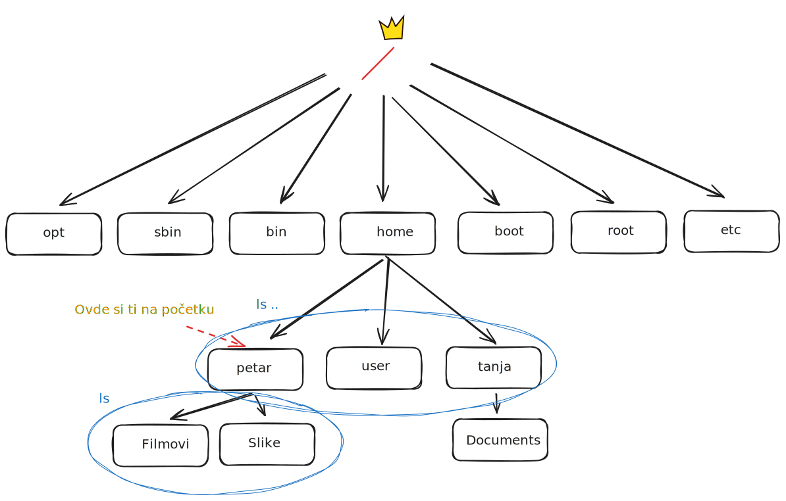
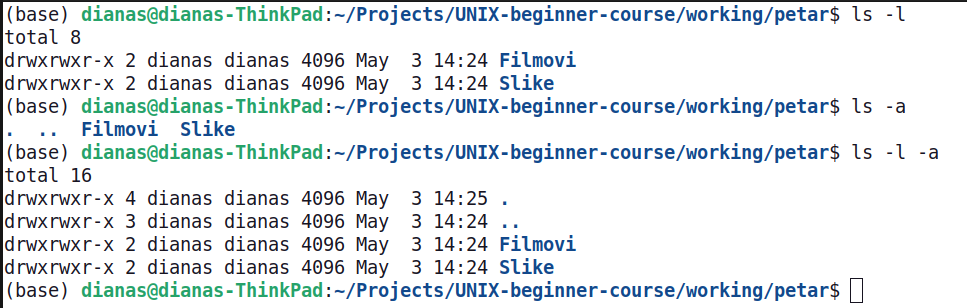

<link rel="stylesheet" href="/UNIX-beginner-course/assets/css/custom.css">

## `ls`

Sada kada možemo da se krećemo po sistemu datoteka, bitno je da možemo da vidimo šta se od fajlova i direktorijuma nalazi gde u našem sistemu datoteka. Za te potrebe se koristi komanda `ls`. Ona nam služi da izlista sadržaj trenutnog direktorijuma. Od opcija korisne su:
* `-a` - prikaz fajlova čiji naziv počinje sa `.`
* `-l` - prikaz detalja

Od parametara, ova komanda prima putanju do direktorijuma kom treba da se izlistra sadržaj. Ukoliko se ne prosledi parametar, izlistaće sadržaj direktorijuma u kom smo trenutno.

Prvo ćemo preči primer bez opcija i parametara. Kao što se vidi na slici ispod, trenutno se nalazimo u direktorijumu `/home/petar`. Kada unesemo komandu `ls`, videćemo da se tu nalaze direktorijumi `Slike` i `Filmovi` kao što se vidi i na slici sistema datoteka.

Ukoliko želimo da vidimo sadržaj direktorijuma `/home`, to možemo uraditi tako što ćemo sa komandom `cd /home` ili `cd ..` promenitit trenutan direktorijum i ponovo uneti komandu `ls`, ili jednostavnije, tako što komandi `ls` prosledimo samo putanju (apsolutnu ili relativnu) do direkotijuma čiji sadržaj želimo da vidimo, kao što je prikazano na slici ispod. 

Možda ste primetili da se sa `ls` ne vide ona dva pokazivača `.` i `..` koji se vide u tekstualnom editoru. Osim njih, većina konfiguracionih fajlova na UNIX sistemima imaju naziv koji počinje sa `.`. Oni su takozvani "sakriveni fajlovi" i da bi ih videli, potrebno je komandi `ls` proslediti opciju `-a`. Primer je dat na slici ispod.

Još jedna pomenuta opcija je `-l`. Ona nam služi da vidimo detalje fajlova i foldera koje izlistavamo. Neki od stvari koje se vide su permisije (biće kasnije objašnjene), korisnik i grupa koji su vlasnici fajla/direktorijuma, veličina, datum i vreme medifikacije i potom naziv. Primer je dat na slici ispod. Ukoliko želite da vidite sve to i za sakrivene fajlove, potrebno je proslediti obe opcije komandi (`ls -l -a /home/user/Downlods`). Ovaj primer prepuštamo čitaocu da proba.

  

    <a href="2_2-cd.html" class="button-nav">← Prethodna</a>
  

  

    <a href="2_4-cp.html" class="button-nav">Sledeća →</a>
  

