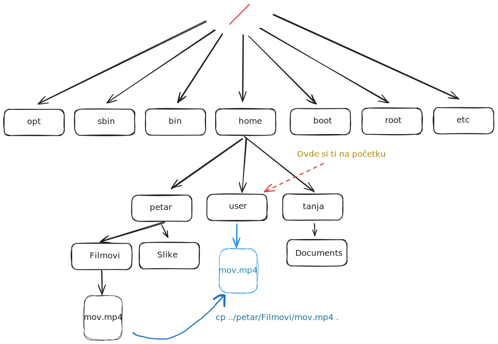

<link rel="stylesheet" href="/UNIX-beginner-course/assets/css/custom.css">

 

  <a href="/UNIX-beginner-course/" class="button-nav">⟵ Nazad na početak</a>

# Kopiranje - cp

`cp` (CoPy files and directories) komanda služi za kopiranje fajlova i direktorijuma (kao copy-paste). Od parametara prima putanju na kojoj se nalazi direktorijum ili fajl i putanju na koju se kopira. 
Ukoliko direktorijum nije prazan, bez prosleđivanja opcija komandi, vratiće grešku i neće prekopirati ceo direktorijum. Iz tog razloga se koristi opcija `-r` (rekurzivno). Na primer, ukoliko želimo da prekopiramo direktorijum `Filmovi` (koji ima fajlove u sebi kao što se vidi na slici sistema direktorijuma) u `/home/user` (gde se trenutno nalazimo), komanda bi izgledala ovako: `cp -r /home/petar/Filmovi .` .

  

    <a href="2_3-ls.html" class="button-nav">← Prethodna</a>
  

  

    <a href="2_5-rm.html" class="button-nav">Sledeća →</a>
  

