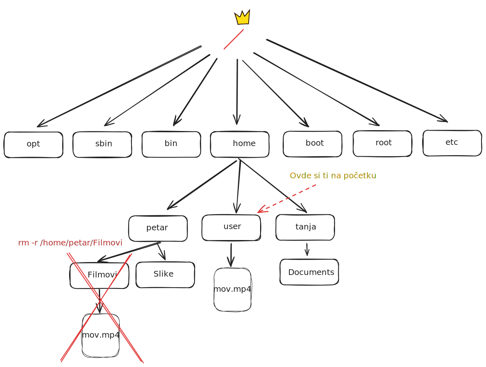

<link rel="stylesheet" href="/UNIX-beginner-course/assets/css/custom.css">

  <a href="/UNIX-beginner-course/" class="button-nav">⟵ Nazad na početak</a>

## Brisanje - `rm`

Ova komanda služi za brisanje fajlova i direktorijuma (ReMove files or directories). Od parametara prima putanju do fajla ili direktorijuma koji želimo da uklonimo. Kada se unese komanda i pritisne enter, bez dodatne provere, fajl na toj putanji će biti obrisan, zato je potreban poseban oprez prilikom unosa parametara. Ukoliko se briše direktorijum, bitno je da se isti prvo napusti, u suprotnom komanda će vratiti grešku.

Isto kao i `cd`, `rm` neće obrisati direktorijum ukoliko nije prazan. Da ovo rešimo, koristi se opcija `-r` (rekurzivno). Ukoliko znamo da je direktorijum prazan i želimo da budemo sigurni da ga nećemo ukloniti ako nije, može se koristiti opcija `-d`. Sa njom, komanda će se izvršiti samo ako je direktorijum prazan (fajlove neće ukloniti). Postoji i posebna komanda koja radi istu stvar `rmdir`.

Primer: ukoliko želimo da obrišemo direktorijum `Filmovi` sa fajlom `mov.mp4`, koristićemo `rm -r` sa putanjom. Na slici se nalazi izgled naših direktorijuma, a u terminalu ispod i kako se pišu komande.

Još jedna bitna opcija je `-f` (force). Nekada su fajlovi ili direktorijumi zaštićeni, te će ispisivati upozorenje, ili neće dozvoljavati brisanje bez ove opcije. Ukoliko ste sigurni da želite da obrišete taj fajl, potrebno je proslediti opciju `-f`.

**BITNO** Verovatno ćete naići na komandu `rm -rf /*`. Ona u principu znači da treba da se obriše sve iz `/` direktorijuma, `-r` rekurzivno, uključujući i zaštićene fajlove (`-f`) i time brišete ceo sistem. Danas postoje zaštite od njenog izvršavanja, ali svakako ne treba pokušavati njeno izvršavanje.

*Napomena: U ovom slučaju, skraćenica za opciju **rekurzivno** su se poklopile sa komandom `cp`. Bitno je napomenuti da to NIJE uvek slučaj i da se može desiti da komande imaju istu slovnu skraćenicu za opciju, a drugo značenje, te je bitno obratiti pažnju na to.*

  

    <a href="2_4-cp.html" class="button-nav">← Prethodna</a>
  

  

    <a href="2_6-mkdir.html" class="button-nav">Sledeća →</a>
  

