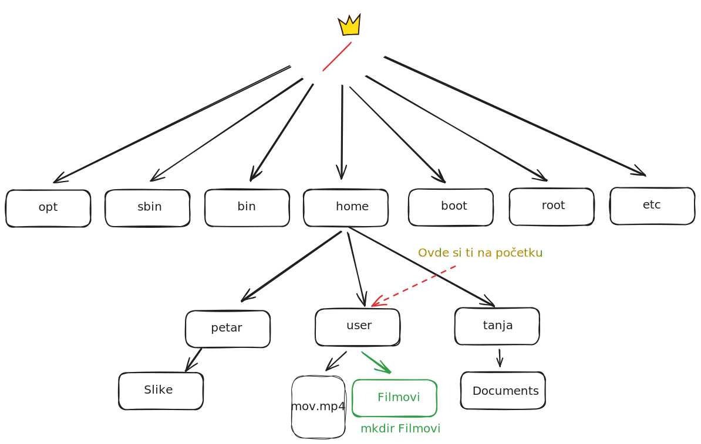

<link rel="stylesheet" href="/UNIX-beginner-course/assets/css/custom.css">

  <a href="/UNIX-beginner-course/" class="button-nav">⟵ Nazad na početak</a>

## Kreiranje direktorijuma - `mkdir`

## Nazivi sa specijalnim karakterima

Ovde treba prvo opisati mkdir komandu sa opcijom -p i da napravimo direktorijum za nas film

Sada je vreme da pokrijemo i ovaj segment, kako da koristimo neke specijalne karaktere u nazivima naših direktorijuma i fajlova. Verovatno već znate, da na Windows sistemu ne možete sve karaktere da koristite za nazive direktorijuma (`<`, `>`, `:`, `"`, `/`, `\`, `|`, `?`, `*`). Slična situacija je i sa UNIX sistemima, samo je lista malo duža, te obuhvata i ` ` (razmak, ili tab), `$`, `&`, `+`, itd. Razlog za to je što ti karakteri imaju specijalnu namenu. Kasnije na predavanju će biti objašnjeno kako se mogu koristiti (ili se ostavlja čitaocu za istraživanje), a sada će se preći kako da koristimo ove specijalne karaktere u nazivu direktorijuma (ili fajla) kada ga pravimo iz temrinala.

Ukoliko želimo da tretiramo specijalne karaktere kao obične, potrebno je staviti `\` ispred njih (to važi i za upotrebu specijalnog kraktera `\`). Tako da ukoliko direktorijum želimo da nazovemo "UNIX vezbe", `mkdir` komanda bi izgledala ovako `mkdir "UNIX\ vezbe` ili `mkdir /home/user/Petnica-rac/UNIX\ vezbe`. Isto važi ukoliko želimo da nazovemo direktorijum `Ovo"je?naziv`, komanda bi izgledala ovako `mkdir Ovo\"je\?naziv`. Ukoliko unesemo samo `mkdir UNIX vezbe`, dobićemo dva direktorijuma. Primeri se mogu videti na slici ispod, a čitaocu se ostavlja da isproba i druge specijalne karaktere.

Za većinu karaktera, situacija može biti prostija (osim za `\`, `"`, `'`). Ukoliko naziv direktorijuma stavimo pod navodnike, specijalne karaktere obuhvaćene njima će tumačiti kao obične karaktere. Ponovo, ukoliko direktorijum želimo da nazovemo "UNIX vezbe", `mkdir` komanda bi izgledala ovako `mkdir "UNIX vezbe` ili `mkdir "/home/user/Petnica-rac/UNIX vezbe"`. Bitno je primetiti da se cela putanja stavlja pod navodnike, ne samo sporni direktorijum (*u većini slučajeva bi radilo i da se samo sporni direktorijum stavi pod navnodnike, ali se ne praktikuje taj pristup*).

Ovde nedostaje screenshot ovih kombinacija sa specijalnim karakterima

  

    <a href="2_5-rm.html" class="button-nav">← Prethodna</a>
  

  

    <a href="2_7-mv.html" class="button-nav">Sledeća →</a>
  

