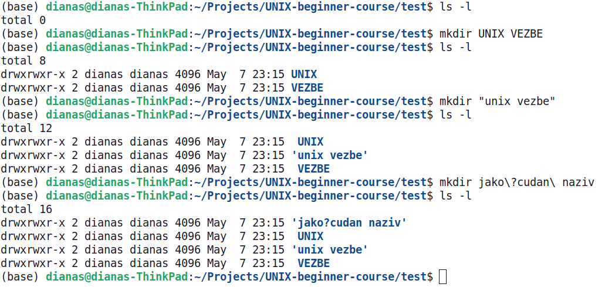

<link rel="stylesheet" href="/UNIX-beginner-course/assets/css/custom.css">

 

  <a href="/UNIX-beginner-course/" class="button-nav">⟵ Nazad na početak</a>

# Kreiranje direktorijuma - mkdir

`mkdir` je jednostavna komanda koja pravi direktorijum na željenoj putanji. Kao parametar se prosleđuje putanja koja na kraju sadrži naziv direktorijuma koji pravimo. Ukoliko se navede samo naziv direktorijuma, biće napravljen u trenutnom direktorijumu. Bitna napomena je da se komanda neće izvršiti ukoliko ne postoji prosleđena putanja (odnosno ako neki direktorijum u putanji nedostaje).

Međutim, ukoliko želimo da napravimo sve direktorijume koji nedostaju u našoj putanji, to možemo uraditi tako što prosledimo opciju `-p`. Sa ovom opcijom, `mkdir` će napraviti sve roditeljske direktorijume koji nedostaju.

Primer upotrebe `mkdir` komande se može videti u terminalu, a kako se to odražava na sistem direktorijuma se vidi na slici ispod.

# Nazivi sa specijalnim karakterima

Sada je vreme da pokrijemo i ovaj segment, kako da koristimo neke specijalne karaktere u nazivima naših direktorijuma i fajlova. Verovatno već znate, da na Windows sistemu ne možete sve karaktere da koristite za nazive direktorijuma (`<`, `>`, `:`, `"`, `/`, `\`, `|`, `?`, `*`). Slična situacija je i sa UNIX sistemima, samo je lista malo duža, te obuhvata i `\t` (razmak, ili tab), `$`, `&`, `+`, itd. Razlog za to je što ti karakteri imaju specijalnu namenu. Kasnije na predavanju uživo će biti objašnjeno kako se mogu koristiti (ili se ostavlja čitaocu za istraživanje), a sada će se preći kako da koristimo ove specijalne karaktere u nazivu direktorijuma (ili fajla) kada ga pravimo iz terminala.

Ukoliko želimo da tretiramo specijalne karaktere kao obične, potrebno je staviti `\` ispred njih (to važi i za upotrebu specijalnog karaktera `\`). Tako da ukoliko direktorijum želimo da nazovemo "UNIX vezbe", `mkdir` komanda bi izgledala ovako `mkdir "UNIX\ vezbe` ili `mkdir -p /home/user/Petnica-rac/UNIX\ vezbe`. Isto važi ukoliko želimo da nazovemo direktorijum `Ovo"je?naziv`, komanda bi izgledala ovako `mkdir Ovo\"je\?naziv`. Ukoliko unesemo samo `mkdir UNIX vezbe`, dobićemo dva direktorijuma. Primeri se mogu videti na slici ispod, a čitaocu se ostavlja da isproba i druge specijalne karaktere.

Za većinu karaktera, situacija može biti prostija (osim za `\`, `"`, `'`). Ukoliko naziv direktorijuma stavimo pod navodnike, specijalne karaktere obuhvaćene njima će tumačiti kao obične karaktere. Ponovo, ukoliko direktorijum želimo da nazovemo "UNIX vezbe", `mkdir` komanda bi izgledala ovako `mkdir "UNIX vezbe` ili `mkdir "/home/user/Petnica-rac/UNIX vezbe"`.

  

    <a href="2_5-rm.html" class="button-nav">← Prethodna</a>
  

  

    <a href="2_7-mv.html" class="button-nav">Sledeća →</a>
  

