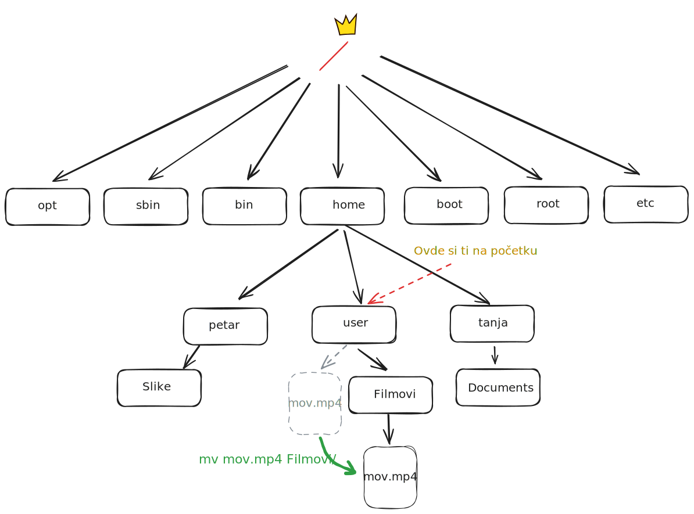
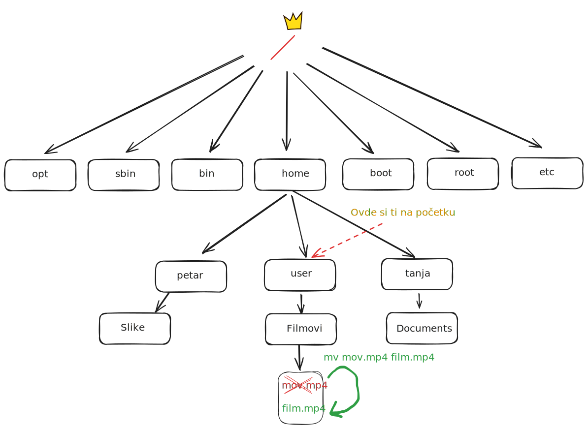

<link rel="stylesheet" href="/UNIX-beginner-course/assets/css/custom.css">

  <a href="/UNIX-beginner-course/" class="button-nav">⟵ Nazad na početak</a>

# Premeštanje - mv

Na kraju, imamo komandu `mv` (MoVe files). Služi nam da premestimo fajlove/direktorijume (kao cut-paste) ili da im promenimo ime, tako što ih "prebacimo" iz jednog imena u drugo. Korisna opcija može biti `-v` (verbose) pre parametara jer tada komanda ispiše početnu i krajnju destinaciju fajla, pa je preglednije ukoliko se izvršava puno komandi.

Od parametara, `mv` prima početnu putanju fajla/direktorijuma koji se pomera i krajnju putanju na koju se prebacuje. Ukoliko se u krajnjoj putanji ne napiše novi naziv, fajl/direktorijum koji premeštamo će ostati istog naziva. Primer premeštanja fajla `mov.mp4` iz direktorijuma `/home/user` u direktorijum `/home/user/Filmovi` bi izgledala ovako `mv /home/user/mov.mp4 /home/user/Filmovi/`. Ispis, kao i primer se vide na slici ispod.

Ukoliko želimo samo da promenimo naziv, potrebno je u krajnjoj distanci samo dodati novi naziv. Za prethodni primer, ukoliko želimo fajl da preimenujemo u `film.mp4`, komanda bi izgledala ovako `mv mov.mp4 film.mp4` (ili ukoliko nismo već premestili fajl `mv mov.mp4 Filmovi/film.mp4`). 

*Napomena: bitno je **ne** zaboraviti ekstenziju kada se menja naziv fajla, jer se ne podrazumeva.* 

  

    <a href="2_6-mkdir.html" class="button-nav">← Prethodna</a>
  

  

    <a href="2_8-vezbe.html" class="button-nav">Sledeća →</a>
  

