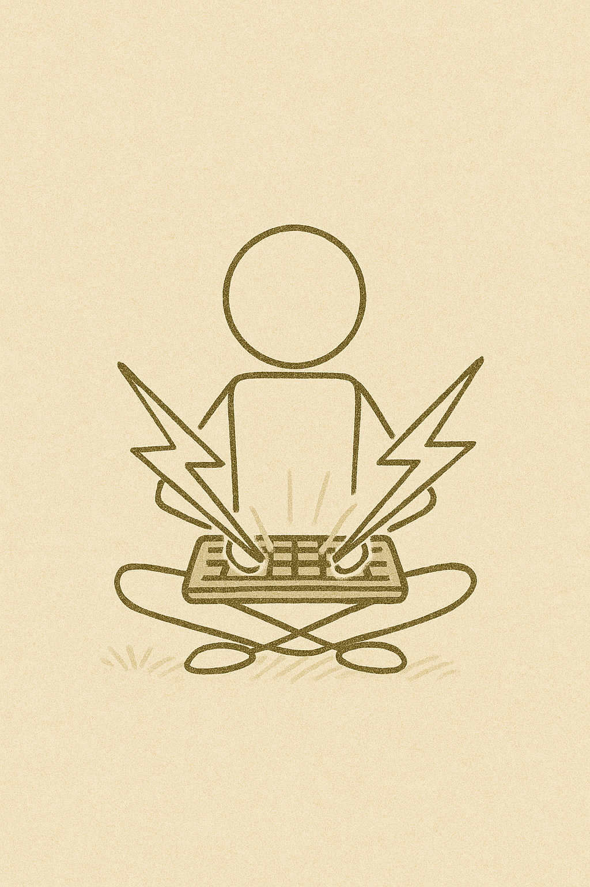
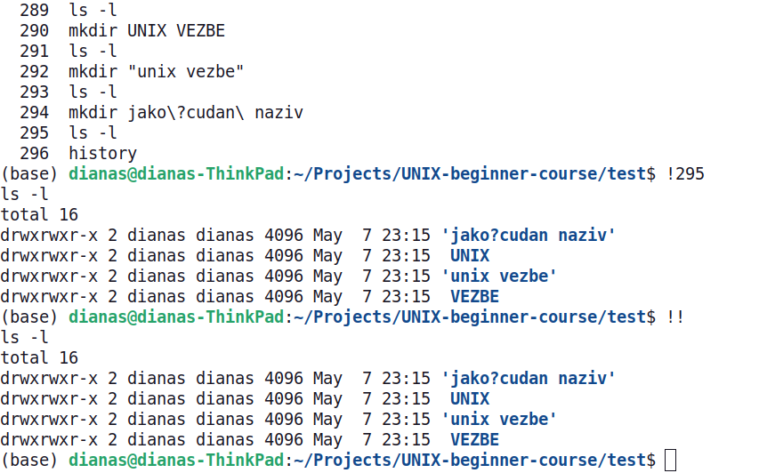

<link rel="stylesheet" href="/UNIX-beginner-course/assets/css/custom.css">

 

  <a href="/UNIX-beginner-course/" class="button-nav">⟵ Nazad na početak</a>

# Prečice u terminalu

Sigurno ste primetili da nakon ovih vežbi ima mnogo više nepotrebnog teksta na terminalu. Da uklonimo taj tekst možemo da koristimo komandu `clear` ili kraće `ctrl + l`. Ako koristite terminal emulator (a ne, npr tty), skrolovanjem na gore ćete videti i dalje test koji je bio ispisan. Ukoliko želite i taj ispis da uklonite, koristite komandu `reset`. 

*Napomena: ova komanda nema veze sa resetovanjem sistema, za to se koristi `reboot`.*

Još jedna korisna komanda je `history`. Tu se nalaze sve komande koje ste do sada uneli, ukoliko ih niste započeli sa whitespace karakterom. Vašu istoriju komandi možete i ručno videti u fajlu `/home/user/.bash_history`. 
Ukoliko koristite `bash`, kada unesete komandu `history` videćete i redni broj pored komande. To je korisno zato što referenciranjem tog broja možete ponovo izvršiti tu komandu. Da to uradite, unesite uzvičnik i redni broj komande koju želite da ponovite, npr. `!5`. Ovo je korisno kada je potrebno da se ponove duže komande. Ukoliko želite samo da ponovite poslednju komandu, skraćeno to možete uraditi sa `!!`, primeri su dati na slici ispod. Takođe, ukoliko samo želite da se krećete kroz istoriju komandi, to možete uraditi pritiskanjem strelice na gore.

Postoje i skraćenice za navigaciju u samoj liniji u terminalu. Na primer, ukoliko želite da se vratite na početak linije, potrebno je uneti `ctrl + a`, ili na kraj sa `ctrl + e`. `ctrl + u` će vam ukloniti celu liniju. 

Još jedna korisna stvar je autocomplete. Kada na primer unosite putanju, možete je autocomplete-ovati pritiskanjem tastera `tab`. Ukoliko postoji više fajlova, ili direktorijuma sa istim početkom naziva, pritisnite dva puta taster `tab` da vidite sve opcije.

  

    <a href="2_8-vezbe.html" class="button-nav">← Prethodna</a>
  

  

    <a href="3_2-man.html" class="button-nav">Sledeća →</a>
  

