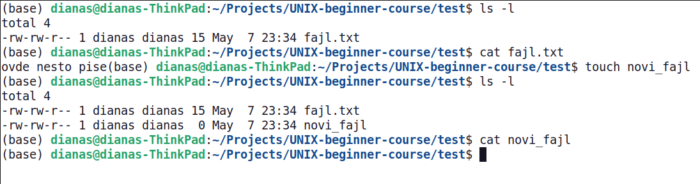

<link rel="stylesheet" href="/UNIX-beginner-course/assets/css/custom.css">
 

  <a href="/UNIX-beginner-course/" class="button-nav">⟵ Nazad na početak</a>

# Kreiranje i prikazivanje fajlova bez tekstualnog editora

Pre nego što pređemo na upotrebu tekstualnog editora, korisno je napomenuti da se prazan fajl može napraviti i upotrebom komande `touch` i prikazati upotrebom komande `cat`. Kao parametar, obe komande primaju putanju do fajla, odnosno gde on treba da se nalazi. Primer je prikazan na slici ispod.

*Napomena: komanda `cat` može i da popuni sadržaj fajla, ali to se ostavlja čitaocu da istraži.*

  

    <a href="3-faster_terminal_navigation.html" class="button-nav">← Prethodna</a>
  

  

    <a href="4_2-vim.html" class="button-nav">Sledeća →</a>
  

