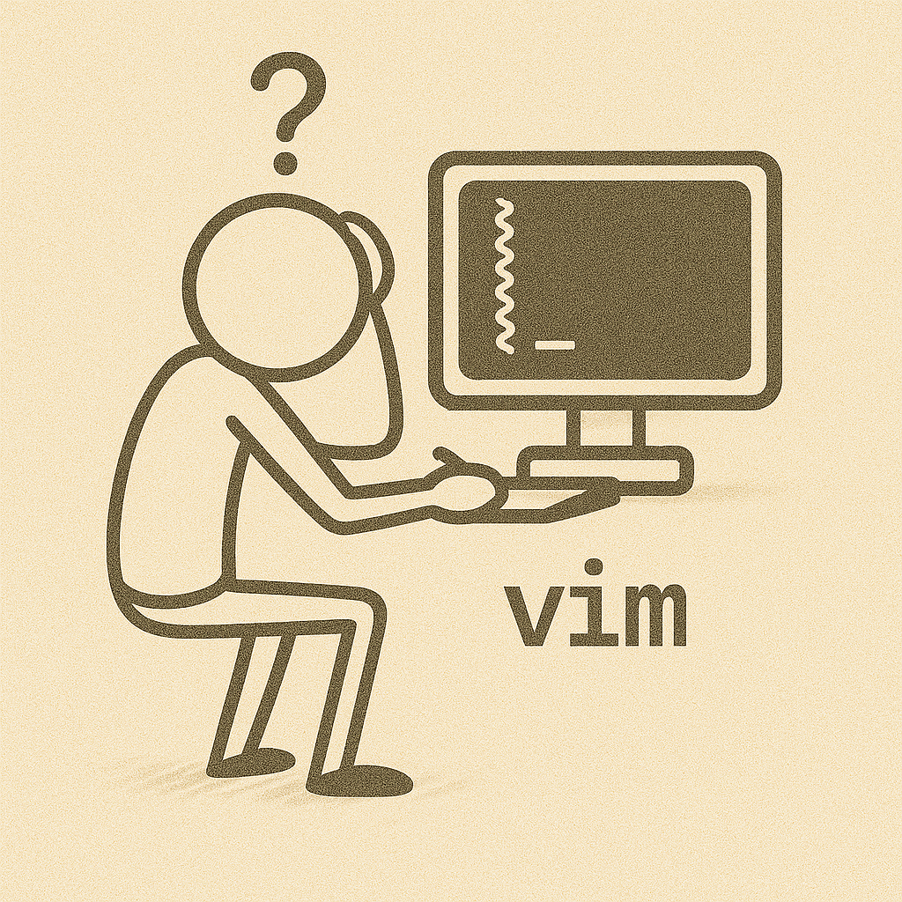
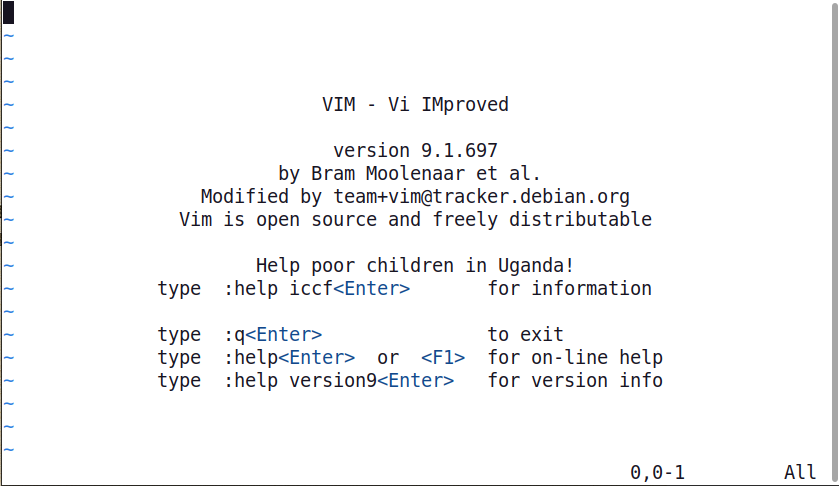

<link rel="stylesheet" href="/UNIX-beginner-course/assets/css/custom.css">

 

  <a href="/UNIX-beginner-course/" class="button-nav">⟵ Nazad na početak</a>

# Vim

**Vim** (VI Improved) je tekstualni editor koji se koristi iz konzolne linije. Postoji i starija verzija `vi`, koja je dostupna bez dodatnih instalacija na sistemima. Komunikacija sa ovim editorom se realizuje bez upotrebe miša tako što omogućava dva mode-a u kojima radi: command mode i insert mode.

# Command mode
Ovaj mode nam omogućava da izvršavamo tekstualne komande nad tekstom (odnosno fajlom). Neke osnovne komande koje će nam trebati su *undo*, *save*, *quit*, *copy - paste* i pomeranje kurzora.

Onog trenutka kada pokrenete `vim` (unošenjem komande `vim` bez parametara u konzolu), pojaviće se prozor prikazan na slici ispod. Po default-u, `vim` je pokrenut u command mode-u i možemo probati da unesemo prvu komandu. Za tekstualne komande, potrebno je uneti `:` i potom tekst komande. Na primer, za pomoć, unosimo `:help` (pojavljuje se prompt u donjem levom uglu dok kucamo) i kada pritisnemo `enter` dobićemo pomoć. Da izađemo iz ovog prozora potrebno je da unesemo `:quit` (skraćeno `:q`) i vratićemo se na početni prozor. Ukoliko želimo da napustimo editor, potrebno je ponovo uneti komandu `:quit`.

Ako se vratimo u `vim`, možemo primetiti da svaka linija, osnim one u kojoj je kurzor, počinje sa `~`. To je oznaka da ta linija ne postoji zaista u fajlu, čak nema ni prazan red tu.

Sada je vreme da nešto upišemo u taj fajl.

  

    <a href="4_1-touch.html" class="button-nav">← Prethodna</a>
  

  

    <a href="4_3-vim_insert_mode.html" class="button-nav">Sledeća →</a>
  

