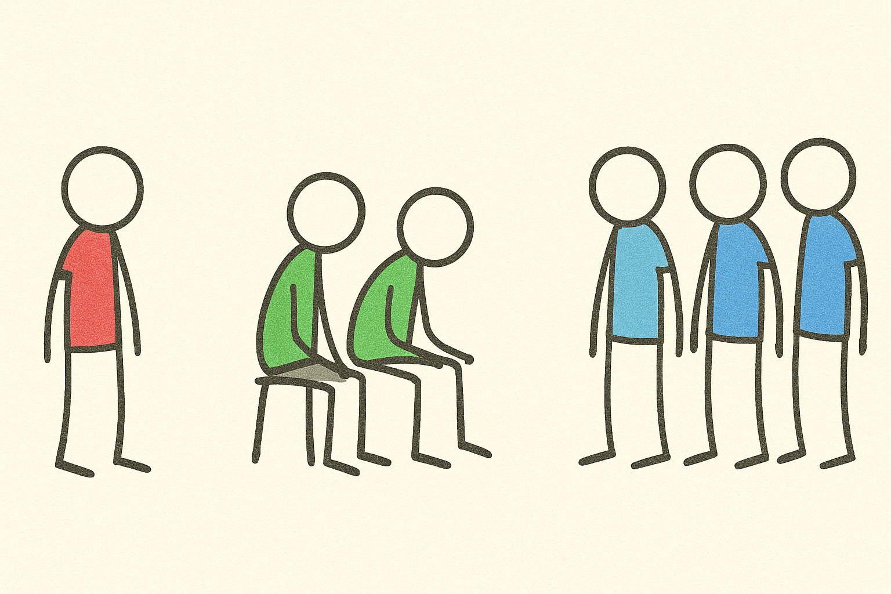

<link rel="stylesheet" href="/UNIX-beginner-course/assets/css/custom.css">

 

  <a href="/UNIX-beginner-course/" class="button-nav">⟵ Nazad na početak</a>

# `-rwxr-xr--`

Prvo je bitno primetiti da ovaj zapis uvek ima 10 karaktera, koji se mogu podeliti u 4 sekcije, kao što je prikazano na slici ispod. 

Prvi karakter nam govori kakav fajl je u pitanju (jer je "sve fajl" u UNIX sistemu). Najčešće opcije su:
  * `d` - direktorijum
  * `-` - regularni fajl
  * `l` - simbolički link (*Napomena: šta su simbolički linkovi i kako se koriste će biti objašnjeno na predavanju*)

Još neke poznate oznake su:
  * c - character device file
  * b - block devide file
  * s - local socket file
  * p - named pipe

Koje još skraćenice postoje, možete videti na 

Ostalih 9 karaktera možemo podeliti u 3 seta:
1. set dozvola za vlasnika
2. set dozvola za članove grupe vlasnika
3. set dozvola za ostale

Vlasnik fajla, je korisnik koji ga je napravio. Međutim, svaki put kada se napravi novi korisnik na UNIX sistemu, nastaje i istoimena grupa koja na početku sadrži samo jednog korisnika. Ukoliko korisnik želi da deli neke fajlove sa drugim učesnicima sistema, može ih dodati u ovu grupu i onda menjati pristupne parametre za tu grupu. Bitno je napomenuti da je moguće napraviti i samo grupu, te u nju dodavati korisnike, ali to je druga tema. 

  

    <a href="5_1-permissions.html" class="button-nav">← Prethodna</a>
  

  

    <a href="5_3-chmod.html" class="button-nav">Sledeća →</a>
  

