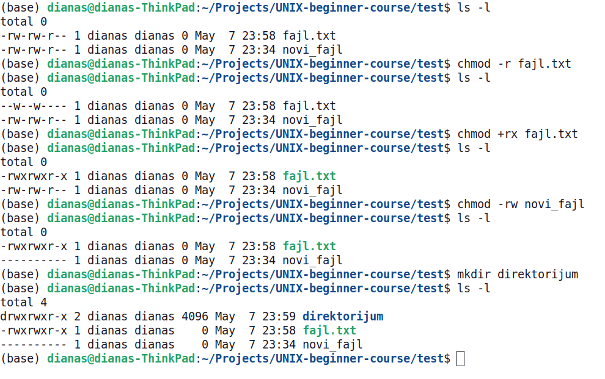
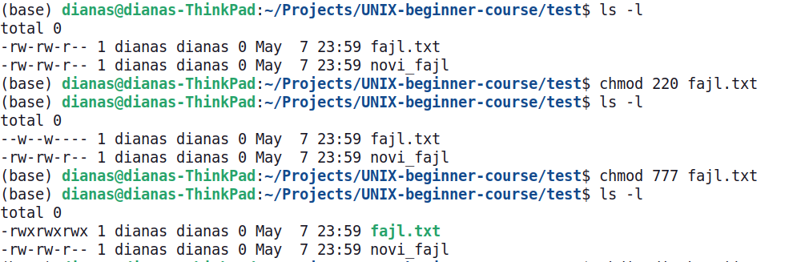

<link rel="stylesheet" href="/UNIX-beginner-course/assets/css/custom.css">

  <a href="/UNIX-beginner-course/" class="button-nav">⟵ Nazad na početak</a>

## Promena dozvola - chmod
Sada kada znamo šta znače, potrebno je razjasniti i kako možemo da ih menjamo i koristimo. Komanda za promenu dozvola je `chmod` (CHange file MODe bits). Kada se menjaju dozvole, potrebno je dati odgovor na 3 pitanja:
  * *Kome* (*whom*) menjamo dozvolu?
    - `u` (user), korisniku
    - `g` (group), grupi
    - `o` (other), ostalima
    - `a` (all), svima

  Ukoliko izostavimo karakter, podrazumeva se da se menja korisniku.

  * *Šta* (*what*) radimo?
    - `-` Uklanjamo dozvolu
    - `+` Dajemo dozvolu
    - `=` Postavljamo konkretno te dozvole, a sve ostale uklanjamo

  * *Koju* dozvolu (*which*)?
    - `r`
    - `w`
    - `x`

U nastavku se nalazi nekoliko primera `chmod` komandi sa efektima koje postižu.

Postoji još jedna notacija za menjanje dozvola, a to je oktalna. U ovom slučaju, `r`, `w` i `x` se predstavljaju kao stepeni dvojke i koristi se njihova suma da predstavi dozvole za korisnika, grupu i ostale. Vrednosti su dodeljene na sledeći način:
  * x = 2^0 = 1
  * w = 2^1 = 2
  * r = 2^2 = 4

U nastavku na slikama se nalaze primeri u oktalnom zapisu.

  

    <a href="5_2-permisije_razjasnjene.html" class="button-nav">← Prethodna</a>
  

  

    <a href="5_4-permisije_vezbe.html" class="button-nav">Sledeća →</a>
  

