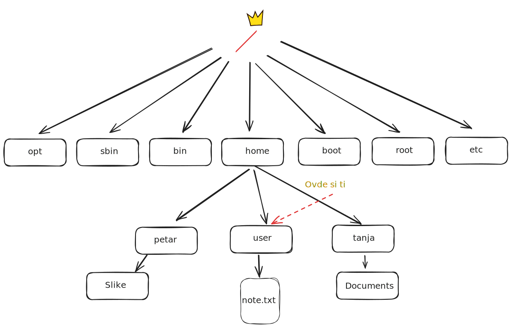

<link rel="stylesheet" href="/UNIX-beginner-course/assets/css/custom.css">

 

  <a href="/UNIX-beginner-course/" class="button-nav">⟵ Nazad na početak</a>

# Pokretanje više komandi

Kako je sada pređeno već više komandi, javlja se potreba da možemo da pokrećemo više komandi više puta. Da se ne bi kretali stalno kroz istoriju, ili ih ponovo unosili, možemo koristiti `;` ili `&&` da pokrenemo više komandi odjednom. Razlika između ove dve komande je u tome da li nam je potrebno da se izvrše sve komande u sekvenci ukoliko dođe do greške u jednoj od njih.

`;` nam omogućava da se bez obzira na to da li se desila greška sve komande izvrše. Zapis linije u tom slučaju je `komanda1 ; komanda2 ; komanda3`. 
Za razliku od prethodnog slučaja, `&&` će prekinuti izvršavanje ukoliko jedna od komandi u sekvenci vrati grešku. Bitno je napomenuti da će u tom slučaju efekat prethodnih komandi **i dalje postojati**. Zapis je `komanda1 && komanda2 && komanda3`.

Primer koji može da nam pokaže razliku je sledeći: Sistem direktorijuma je prikazan na slici. Bitno je napomenuti da direktorijum `Beleske` ne postoji i da postoji `note.txt` u trenutnom direktorijumu. Ukoliko želimo da napravimo istoimeni fajl `note.txt` u novom direktorijumu `Beleske` i da ga odmah obrišemo (radi primera), ispravna komanda bi bila:
`mkdir Beleske ; cd Belekse ; touch note.txt ; rm note.txt`. Međutim, ukoliko greškom ne primetimo da direktorijum ne postoji i koristimo `;` za povezivanje komandi, može se desiti da ostanemo greškom bez istoimenog fajla u trenutnom direktorijumu (`cd Belekse ; touch note.txt ; rm note.txt`). 
Kada se rade ovakve stvari, bezbednije je koristiti `&&`, zato što bi u istoj situaciji i sa istom greškom grupa komandi `cd Beleske && touch note.txt && rm note.txt` vratila grešku još na `cd` komandi i ne bi obrisala pogrešan fajl.

Međutim, ukoliko želimo da uradimo nešto kompleksnije, ovakav zapis nam nije čitljiv, te je potrebno da se upoznamo sa skriptama.

## 🚀 Pokreni odmah u Codespaces

  

    <a href="5_4-permisije_vezbe.html" class="button-nav">← Prethodna</a>
  

  

    <a href="6_2-pisanje_prazne_skripte.html" class="button-nav">Sledeća →</a>
  

