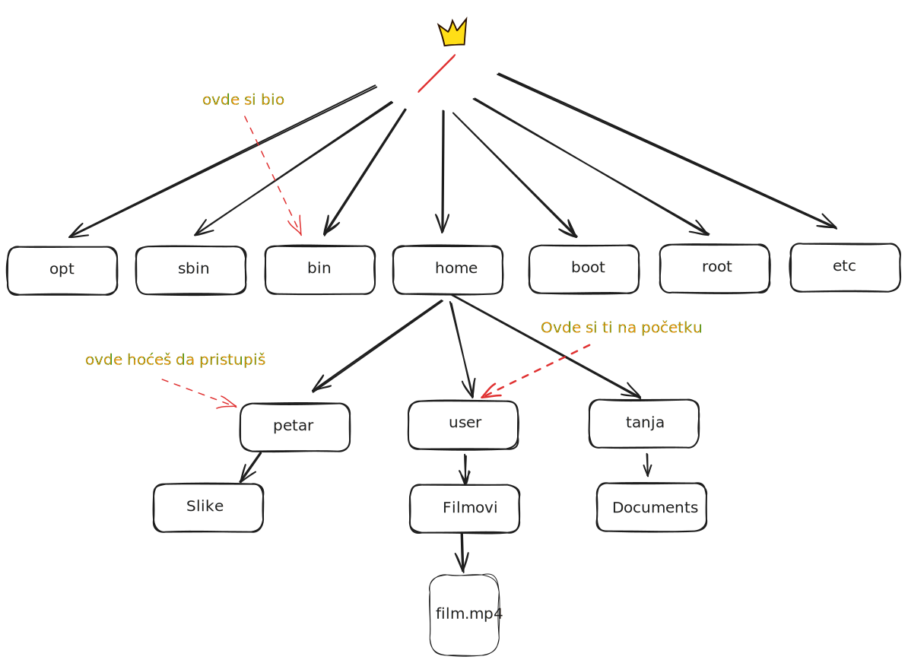
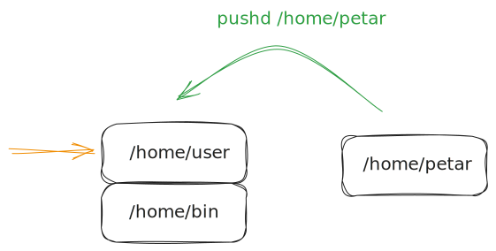
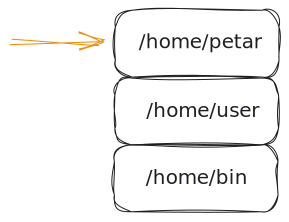
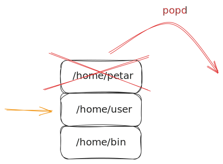

<link rel="stylesheet" href="/UNIX-beginner-course/assets/css/custom.css">

 

  <a href="/UNIX-beginner-course/" class="button-nav">⟵ Nazad na početak</a>

## Promena direktorijuma
Promena direktorijuma u skripti je moguća upotrebom `cd` komande koju koristimo i inače u terminalu.

Druga opcija je da se koriste `pushd` i `popd` komande. One funkcionišu kao stack, odnosno `pushd` dodaje direktorijum na stack i `popd` uklanja. Ovo je korisno, zato što nam omogućava da se lakše vratimo u direktorijum u kom smo bili.

Primer na našem sistemu direktorijuma bi bio sledeći. Ukoliko imamo naš sistem datoteka (prikazan na slici ispod) i želimo iz `/home/user` da pristupimo kratko `/home/petar` to možemo uraditi jednostavno sa `pushd /home/petar` (ili da koristimo relativnu putanju) i onda se vraćamo u prethodni direktorijum sa prostim `popd`. 

  

    <a href="6_3-hello_world.html" class="button-nav">← Prethodna</a>
  

  

    <a href="6_5-parametri.html" class="button-nav">Sledeća →</a>
  

