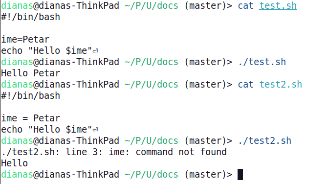

<link rel="stylesheet" href="/UNIX-beginner-course/assets/css/custom.css">

 

  <a href="/UNIX-beginner-course/" class="button-nav">⟵ Nazad na početak</a>

# Varijable

Osim parametara, korisno nam je da imamo varijable u kojima bi pamtili stvari i unutar same skripte. Način definisanja varijabli je jednostavan, za početak ne definišemo tip varijable. Potrebno je samo da napišemo ime varijable i dodelimo joj vrednost. Na primer `ime="Petar"` je definisanje varijable `ime` i inicijalizovanje iste sa stringom `Petar`. Bitno je napomenuti da se **ne** piše razmak oko znaka jednakosti, u suprotnom će skripta vratiti grešku da komanda `ime varijable` nije pronađena.

Bitno je napomenuti da postoje i sistemske varijable i menjanje vrednosti njima će uticati na rad sistema. Konvencija je da se one pišu svim velikim slovima i neke poznate su:
  * `USER` - trenutni korisnik
  * `HOME` - putanja do kućnog direktorijuma trenutnog korisnika
  * `PATH` - lista direktorijuma u kojima se traže izvršne datoteke

Vrednostima svih varijabli se pristupa upotrebom `$`, tako i ovim sistemskim. Ukoliko ispišete `echo $USER` videćete svoje korisničko ime. U slučaju naše variable `ime`, `echo $ime` će ispisati `Petar` na ekranu.

  

    <a href="6_5-parametri.html" class="button-nav">← Prethodna</a>
  

  

    <a href="6_7-read.html" class="button-nav">Sledeća →</a>
  

