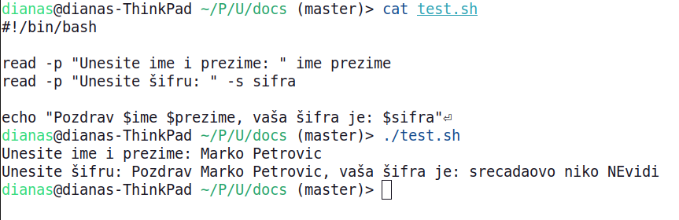

<link rel="stylesheet" href="/UNIX-beginner-course/assets/css/custom.css">

 

  <a href="/UNIX-beginner-course/" class="button-nav">⟵ Nazad na početak</a>

# Učitavanje vrednosti od korisnika - `read`

Sada kada znamo kako da sačuvamo vrednosti u varijablama, potrebno je da vidimo kako možemo da učitamo vrednosti od korisnika, a da ne prosleđujemo ulaz kao parametar. Komanda `read` nam omogućava da prikupimo ulaz od korisnika. Ovaj komandi se kao parametri prosleđuju imena varijabli u koje treba da smesti vrednost. Ukoliko se prosledi samo jedna varijabla, sav unos do prvog pritiska tastera `enter` će biti smešten u jednu varijablu, bez obzira da li je unet neki razmak (iako se ne stave navodnici). Ukoliko se prosledi više od jedne varijable, ulaz će biti podeljen po razmacima. Kako ovo izgleda u praksi se može videti na primerima na slici ispod.
Od opcija, ova komanda ima dve interesantne: `-p` i -`s`. 
  * `-p` opcija nam omogućava da u istoj liniji damo i ispis za korisnika, bez da koristimo i `echo` komandu. Npr. `read -p 'Unesite korisničko ime': var_ime`
  * `-s` služi da se očuva privatnost kada se unosi šifra. Ukoliko ste imali potrebu do sada da unosite svoju šifru u terminal, verovatno ste primetili da se ništa ne ispisuje, čak ni *. Ukoliko želite takav tip unosa, prosledite ovaj parametar komandi `read`. Npr `read -s -p 'Unesite šifru: ' var_password` neće ispisivati ništa dok korisnik kuca, a nakon pritiska tastera `enter`, unos će biti sačuvan u varijabli `var_password`.

  

    <a href="6_6-varijable.html" class="button-nav">← Prethodna</a>
  

  

    <a href="6_8-aritmeticke_operacije.html" class="button-nav">Sledeća →</a>
  

